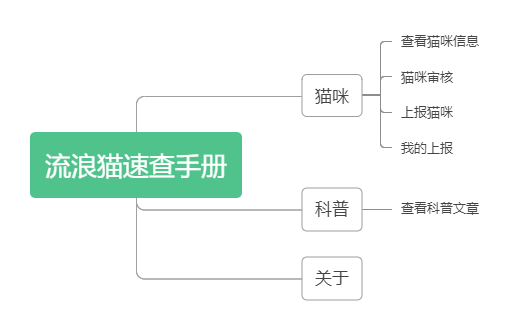
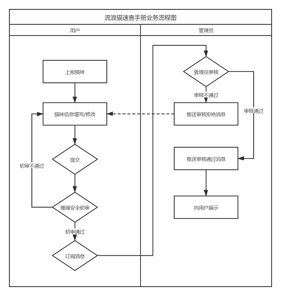

# 流浪猫速查手册 - Cats

> 快速查询附近的流浪猫 帮你找到"梦中情猫"

## 项目依赖

* [dcloudio/uni-app](https://github.com/dcloudio/uni-app)

* [jin-yufeng/Parser](https://github.com/jin-yufeng/Parser)

* [weilanwl/ColorUI](https://github.com/weilanwl/ColorUI)

* [iconfont](https://www.iconfont.cn/)

## 项目背景

今年5月中下旬，作者在网上发现了一款非常有爱的小程序，叫做《燕园猫速查手册》，因为作者本身也参与流浪猫的救助工作，流浪猫的管理主要是靠记忆，非常不方便管理，于是用业余时间参考《燕园猫速查手册》开发了《流浪猫速查手册》小程序，主要针对的是社会上的流浪猫信息的管理。后续也会开放 `领养` 等模块，致力于倡导大家**关爱流浪猫，领养代替购买。**

6月1日上线了 `1.0.0` 版本，小程序中只有查看功能，配套也开发了一个 `PC` 管理端，上线后发现志愿者和救助站等人员不习惯使用 `PC` 端操作，也发现了很多细节问题，如流浪猫的隐私保护等。

8月中旬本作者和《燕园猫速查手册》的作者 [circle](https://github.com/circlelq) 在微信中聊了聊，重新梳理的整个小程序的功能模块，也趁此机会报名参加了 `云开发挑战赛`，重构了  `1.0.0` 版本的代码，并迭代了 `2.0.0` 版本。

## 应用场景

为了方便管理流浪猫的信息，把流浪猫的信息分享给喜爱猫咪的小伙伴，流浪猫信息的上报等。

## 目标用户

所有喜欢猫的用户

## 功能模块

<!--  -->

## 实现思路

本项目前端采用 [uni-app](https://uniapp.dcloud.io) 框架开发，后端完全采用 [微信小程序云开发](https://developers.weixin.qq.com/miniprogram/dev/wxcloud/basis/getting-started.html) 实现

### 业务流程图

<!--  -->

## 功能演示

腾讯视频：[https://v.qq.com/x/page/w3153x67dxh.html](https://v.qq.com/x/page/w3153x67dxh.html)

## 效果截图

<!-- 

 -->

## 线上版本

<!--  -->

## 体验版本

<!--  -->

## 部署教程

点击 [deployment.md](./deployment.md) 查看部署教程

## 贡献指南

如果有兴趣一起参与开发和维护本项目可以点击 [contributing.md](./contributing.md) 查看贡献指南

## 开源许可

《流浪猫速查手册》的源代码基于 `GPL-3.0` 协议全网开源，可用于商业用途，如果您使用了《流浪猫速查手册》的源代码，那么您的项目必须遵守 `GPL-3.0` 协议进行全网开源，点击 [LICENSE](./LICENSE) 查看许可协议
